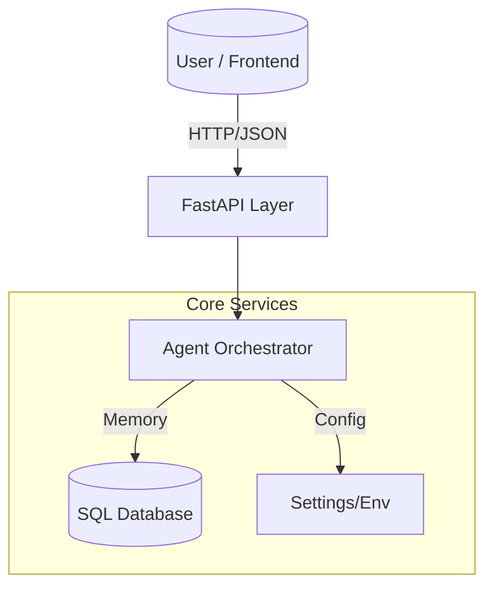

# Intelligent Automation Agent (IAA) - Architectural Blueprint

This document outlines the modular architecture for the IAA project. The goal is to separate concerns, allowing the system to scale from a simple RAG chatbot to a multi-agent system handling Email and Web Automation.

## 1. High-Level Design

The system follows a **Service-Oriented** design within a monolithic repository.

- **API Layer**: FastAPI handles HTTP requests, Validation, and Serving.
- **Orchestrator**: The central brain (LLM Agent) that decides which tool to use.
- **Modules**: Independent subsystems (RAG, Email, Web) that expose clear APIs.



## 2. Recommended Directory Structure

```text
Active Workspace/
├── .env                    # Secrets (API Keys)
├── requirements.txt        # Python Dependencies
├── README.md               # Quick Start
├── ARCHITECTURE.md         # This Layout
├── data/                   # Local data storage
└── src/
    ├── main.py             # FastAPI Entry point
    ├── config.py           # Configuration
    ├── api/                # API Routes & Endpoints
    │   ├── routes/         # Endpoint Definitions
    │   │   └── rag.py
    │   └── schemas/        # Pydantic Request/Response Models
    │       └── rag.py
    ├── core/               # Shared Utilities
    ├── modules/            # RAG, Web, Email
    └── orchestrator/       # Agent Logic
## 3. Component Details

### 3.1. RAG Module (`src/modules/rag`)
- **Responsibility**: Indexing documents and retrieving context.
- **Scalability**: Can swap Milvus Lite for Milvus Cluster. Can enable concurrent indexing.
- **Key Function**: `query_knowledge_base(query: str) -> str`

### 3.2. Web Module (`src/modules/web`)
- **Technology**: Playwright (Async).
- **Responsibility**: Browsing the web, scraping dynamic content, performing actions (clicking, filling).
- **Design**:
    - `BrowserManager`: Singleton to manage browser contexts.
    - `Scraper`: Generic tool to turn URL -> Markdown.

### 3.3. Database Layer (`src/core/database.py`)
- **Technology**: SQLModel (SQLAlchemy wrapper).
- **Responsibility**: Storing user preferences, tasks status, and chat history.
- **Why**: Allows easy migration from SQLite (local) to PostgreSQL (production).

## 4. Implementation Steps to Refactor

1.  **Create Folders**: Set up the `src` hierarchy.
2.  **Migrate RAG**: Move `rag_engine.py` logic into `src/modules/rag/`.
3.  **Migrate UI**: Move `app.py` logic to adapt to the new imports.
4.  **Add Database**: Initialize `src/core/database.py`.
5.  **Add Playwright**: Scaffold `src/modules/web/`.
